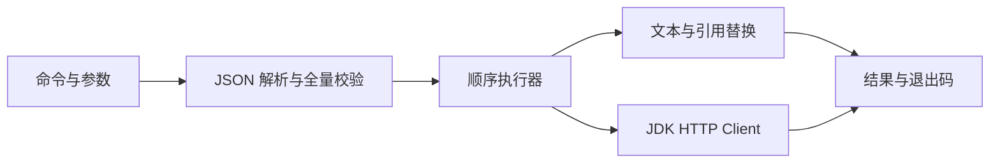

# FlowTrail CLI

### Repeatable text and HTTP tasks from a JSON file

**Describe a sequence once, validate it before execution, and pass each step's output to the next. Run from the terminal with readable progress or structured JSON results.**

**把文本处理与 HTTP 调用写成 JSON，先校验再按顺序执行，并将步骤输出传给后续步骤。在终端查看执行过程，也可输出结构化 JSON 结果。**

The default demo runs offline without an account, model key, or database. A local mock service is included for the HTTP example.

**无需账号、模型密钥或数据库。** 默认示例离线运行，HTTP 示例提供本地模拟服务。

[Quick start / 快速开始](#快速开始) · [Commands / 命令](#四个命令) · [Task definitions / 定义任务](#定义任务)

Windows 可双击根目录 `start.bat`：自动查找 Java 21+。通过菜单运行离线示例、环境诊断或查看帮助。缺少 JAR 时会提示先构建；启动失败保留错误信息。`start.bat -Check` 仅检查启动环境。

```text
$ flowtrail run examples/hello.json
[greeting] 你好，FlowTrail！
[summary] 上一阶段输出：你好，FlowTrail！
Completed 2 steps.
```

## 快速开始

源码构建需要 JDK 21+ 和 Maven 3.8.5+。请先确认 `java -version` 与 `mvn -version` 都指向 JDK 21 或更新版本；可通过 `JAVA_HOME` 指定 JDK。

在仓库根目录执行：

```sh
mvn clean package
java -jar target/flowtrail.jar --help
java -jar target/flowtrail.jar doctor
java -jar target/flowtrail.jar run examples/hello.json
```

也可使用启动脚本：

```powershell
# Windows PowerShell
.\bin\flowtrail.ps1 run examples/hello.json --json
```

```sh
# Linux / macOS
sh bin/flowtrail.sh run examples/hello.json --json
```

构建同时生成 `target/flowtrail-dist.zip`。解压后可直接使用其中的 `bin/` 启动器，只需 JDK 21+，无需 Maven。也可以 `java -jar lib/flowtrail.jar --help`。

## 四个命令

| 命令 | 用途 |
| --- | --- |
| `init [FILE]` | 创建离线示例，默认写入 `flow.json`，拒绝覆盖已有文件 |
| `validate FILE` | 校验定义、步骤 ID、参数和引用，不发送请求 |
| `run FILE` | 校验完整定义后顺序执行，任一步失败立即停止 |
| `doctor` | 检查当前 Java 版本和工作目录可写性 |

每个子命令都支持 `--help` 与 `--json`，版本信息使用 `flowtrail --version`。`--json` 放在子命令后面。

## 定义任务

```json
{
  "name": "greeting",
  "steps": [
    { "id": "first", "type": "text", "text": "Hello" },
    { "id": "second", "type": "text", "text": "${first.output}, FlowTrail!" }
  ]
}
```

- `name` 为非空字符串，`steps` 为非空数组；文件大小不超过 1 MiB。
- 步骤 ID 必须唯一，以 ASCII 字母开头，随后仅允许字母、数字和下划线。
- `text` 步骤需要字符串 `text`。
- `${stepId.output}` 只能引用前面步骤的输出，可用于 `text`、HTTP `url`、`body` 和请求头值。
- 插值只进行一次；输出中包含 `${...}` 不会作为表达式再次执行。
- HTTP 输出是 UTF-8 解码后的原始响应正文；首版不支持 JSONPath 或自动 URL 编码。
- 未知字段、前向引用、错误字段类型和重复 JSON 属性均报错。

HTTP 步骤示例：

```json
{
  "id": "request",
  "type": "http",
  "url": "http://127.0.0.1:8099/echo",
  "method": "POST",
  "headers": { "Content-Type": "text/plain; charset=utf-8" },
  "body": "${first.output}",
  "timeoutSeconds": 5
}
```

`method` 默认 `GET`，仅支持 `GET` 和 `POST`；GET 不允许 `body`。超时默认 10 秒，范围 1–300 秒，覆盖响应正文读取。非 2xx 状态报错，不自动重试或跟随重定向。

地址仅支持 HTTP/HTTPS，禁止内嵌用户名、密码与 URL fragment。含引用的地址在执行时再次检查最终结果；`validate` 对动态地址只检查引用是否合法。请求头名称不区分大小写，不允许重复或设置由客户端管理的 `Host`、`Content-Length` 等头。

任务文件是可执行操作的描述。请只运行自己信任的定义；HTTP 步骤可以访问本机网络，POST 也可能改变目标服务状态。响应正文会保留在内存中，首版面向小型文本 API，不用于大文件下载。程序不打印请求头或失败响应正文，但成功的任务输出仍可能包含敏感内容。

## 本地 HTTP 演示

终端一启动模拟服务，只监听 `127.0.0.1`：

```sh
java --source 21 examples/MockServer.java
```

终端二运行：

```sh
java -jar target/flowtrail.jar validate examples/http.json
java -jar target/flowtrail.jar run examples/http.json
```

模拟服务会将 POST 正文原样返回，最后一步输出 `HTTP response: Hello from FlowTrail`。按 Ctrl+C 停止服务。端口 8099 被占用时，可给模拟服务传入其他端口，并同步修改示例 URL。

## 输出和退出码

普通模式逐步打印结果。`--json` 模式成功时 stdout 只有一个 JSON 文档：

```json
{"ok":true,"name":"greeting","steps":[{"id":"first","output":"Hello"},{"id":"second","output":"Hello, FlowTrail!"}]}
```

失败时 stdout 为空，stderr 输出一个错误对象，已执行步骤的输出不会混入 JSON：

```json
{"ok":false,"exitCode":2,"error":"References must point to an earlier step's output."}
```

| 退出码 | 含义 |
| --- | --- |
| 0 | 成功 |
| 1 | 文件 I/O、网络、超时或 HTTP 状态失败 |
| 2 | 参数或任务定义无效 |
| 130 | 执行线程中断 |

帮助和版本始终输出文本。操作系统直接终止进程时，不保证输出 JSON 错误。

## 设计与学习重点



- **CLI 设计**：picocli 子命令、帮助、stdout/stderr 分离与退出码。
- **Java 工程化**：record 建模、职责拆分、Maven 构建与可执行 JAR。
- **网络编程**：本地 HTTP 调用、总超时、异步取消与资源释放。
- **执行边界**：先校验后执行，错误时保持输出和退出码一致。

见 [设计说明](docs/design.md)、[实现复盘](docs/learning-notes.md) 和 [实际终端演示记录](docs/demo.cast)。演示为 asciicast v2 格式，可用 asciinema 播放；无需播放工具也能按快速开始复现。初始版本在 AI 编程助手协助下实现；后续学习可围绕独立复现、修改和解释设计展开。

首版不包含并行 DAG、Shell 执行、重试、插件市场或 AI 调用。适合下一阶段扩展的主题是：响应大小限制、JSON 结果选择、可配置重试策略。

## 构建与演示检查

```sh
mvn clean package
java -jar target/flowtrail.jar validate examples/hello.json
java -jar target/flowtrail.jar run examples/hello.json
```

HTTP 示例可按上文启动本地模拟服务后运行；不依赖公网 API。

## 许可

本项目代码使用 [MIT](LICENSE)。运行时依赖的许可与署名信息见 [THIRD_PARTY_NOTICES.md](THIRD_PARTY_NOTICES.md) 和 `licenses/`。
